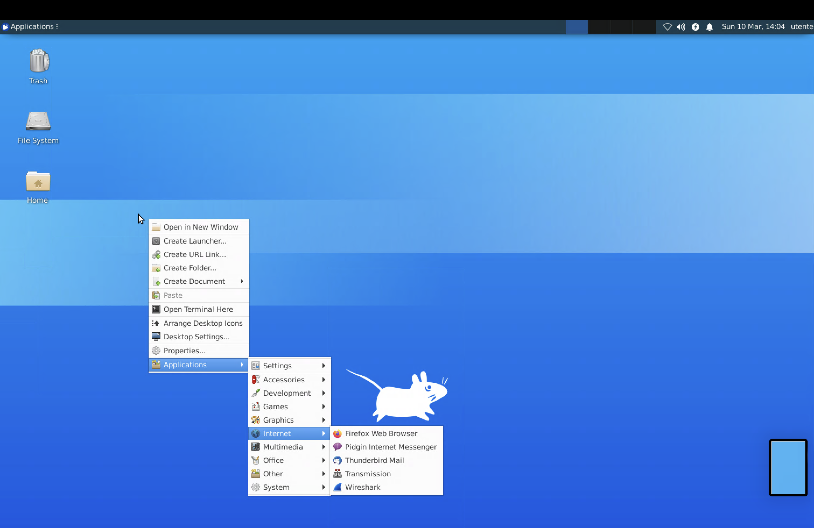
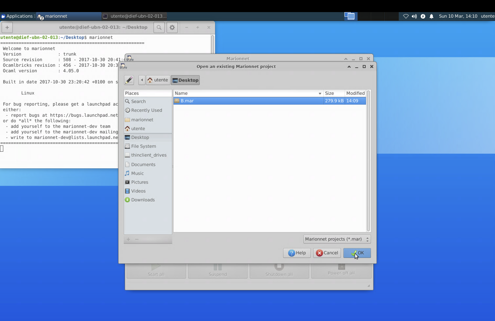

# computernetworks

Exercises made for the Computer Networks exam.

In the `exercises` folder you can find all the lab lessons with the marionnet project, a file containing just the sequence of commands to execute to replicate what was done in class.

In the `workbook` folder you can find additional exercises provided by the professor that I made to practice.

In the `notes` folder you can find some useful files, such as a list of commands with their meaning or some explanations and theory-related contents.

## How to use

### If you use mydesk virtual lab

Once you started the virtual lab: double-click in any free point of the Desktop -> Applications -> Internet -> Firefox Web Browser

Then just digit github in the tab and press `Enter`

Now search in the top-right bar for `SaverioNapolitano` and then click on `Users`

Then just click on the name and you will be redirected to this profile page. Now you can access to the repository exactly like you would do on your computer.

To download a marionnet project, just click on the project and select the `Download raw file` option.

Then move the file from the `Download` folder to the `Desktop` folder.

Now you can easily open it inside marionnet

